# Sistem Pengelolaan Tagihan Air Perumahan Warga

## Mini Project 3 PBO

**Nama Repository:** `Minpro-3-PBO-PengelolaanTagihanAir`

Program ini merupakan pengembangan dari Mini Project 2 dengan tema **Sistem Pengelolaan Tagihan Air Perumahan Warga**. Program dibuat menggunakan Java dan dijalankan melalui console.

Pada Mini Project 3, program dikembangkan dengan menerapkan konsep Pemrograman Berorientasi Objek yang menjadi ketentuan tugas, yaitu **polymorphism, abstraction, inheritance, encapsulation, interface, serta struktur MVC (Model, View, Controller)**.

Program digunakan untuk mengelola data warga, tagihan air, pembayaran, dan data petugas. Program juga dilengkapi validasi input agar data yang dimasukkan tidak kosong, tidak menggunakan ID yang sama, serta tidak menerima nilai yang tidak sesuai dengan aturan program.

---

## Deskripsi Program

Sistem Pengelolaan Tagihan Air Perumahan Warga adalah aplikasi sederhana berbasis Java yang digunakan untuk mengelola administrasi tagihan air warga.

Fitur utama program:

- Menambah data warga
- Melihat data warga
- Mengubah data warga
- Menghapus data warga
- Menambah tagihan air
- Melihat tagihan air
- Mengubah tagihan air
- Menghapus tagihan air
- Menambah pembayaran
- Melihat data pembayaran
- Melihat data petugas
- Menghitung total tagihan berdasarkan pemakaian air
- Mengubah status tagihan menjadi lunas setelah pembayaran berhasil
- Melakukan validasi input

Tarif air yang digunakan dalam program adalah **Rp3.000 per m³**.

---

## Teknologi yang Digunakan

- Bahasa pemrograman: Java
- IDE: NetBeans
- Konsep: Object-Oriented Programming
- Arsitektur: MVC
- Repository: GitHub

---

## Struktur Package

Program menggunakan beberapa package untuk memisahkan tanggung jawab setiap bagian program.

```text
Project PBO
├── controller
│   └── MenuController.java
│
├── model
│   ├── User.java
│   ├── Warga.java
│   ├── Petugas.java
│   ├── TagihanAir.java
│   ├── Pembayaran.java
│   └── DapatDihitung.java
│
├── service
│   └── PengelolaanService.java
│
├── view
│   └── MenuView.java
│
└── Main.java
```

### Dokumentasi Struktur Package

**[SCREENSHOT STRUKTUR PROJECT MVC]**

> Masukkan screenshot struktur project NetBeans yang sudah kamu ambil di folder `docs`. Gunakan nama file `struktur-project.png` agar mudah dipanggil dari README.

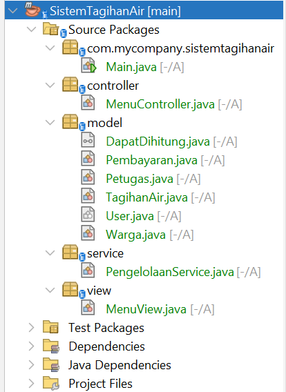

### Controller

Package `controller` berisi `MenuController.java`.

Controller mengatur jalannya program, menerima input dari pengguna, memanggil service, dan menentukan proses yang dilakukan berdasarkan menu yang dipilih.

### Model

Package `model` berisi class yang mewakili objek dalam sistem, yaitu:

- `User`
- `Warga`
- `Petugas`
- `TagihanAir`
- `Pembayaran`
- `DapatDihitung`

Bagian model menyimpan data dan perilaku masing-masing objek.

### Service

Package `service` berisi `PengelolaanService.java`.

Class ini menangani penyimpanan data menggunakan `ArrayList`, pencarian data, penambahan data, serta penghapusan data.

### View

Package `view` berisi `MenuView.java`.

Class ini digunakan untuk menampilkan judul dan menu program kepada pengguna.

---

## Alur Program

Program dimulai dari `Main.java`.

Alur umum program:

```text
Main
  ↓
MenuController
  ↓
MenuView menampilkan menu
  ↓
Pengguna memilih menu
  ↓
MenuController memproses pilihan
  ↓
Service mengelola data
  ↓
Model menyimpan dan mengolah data
  ↓
Hasil ditampilkan kembali kepada pengguna
```

Ketika program dijalankan, pengguna akan melihat menu utama.

**[SCREENSHOT - MENU UTAMA]**

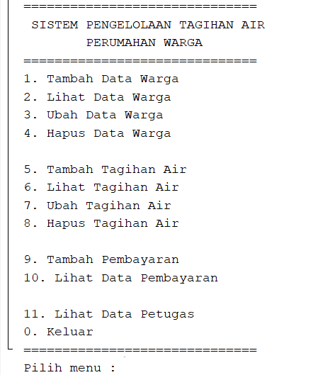

Pengguna dapat memilih fitur warga, tagihan, pembayaran, atau data petugas. Setelah suatu proses selesai, program meminta pengguna menekan ENTER untuk kembali ke menu.

---

# Penerapan Konsep PBO

## Encapsulation

Encapsulation diterapkan dengan membatasi akses langsung terhadap atribut class menggunakan access modifier `private`.

Contohnya pada class `Warga`, atribut `alamat` dan `nomorRumah` dibuat `private`. Akses terhadap atribut tersebut dilakukan melalui method getter dan setter.

**[SCREENSHOT - ENCAPSULATION]**

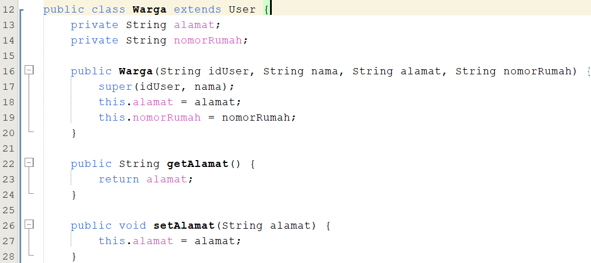

Penerapan ini membuat data di dalam object tidak dapat diubah secara langsung dari luar class. Pengelolaan data dilakukan melalui method yang disediakan oleh class.

---

## Inheritance

Inheritance diterapkan dengan membuat `Warga` dan `Petugas` sebagai turunan dari class `User`.

Hubungannya:

```text
User
├── Warga
└── Petugas
```

Class `Warga` mewarisi atribut dan method dari `User`, kemudian menambahkan atribut `alamat` dan `nomorRumah`.

**[SCREENSHOT - INHERITANCE WARGA]**

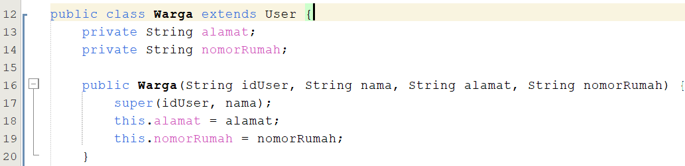

Class `Petugas` juga mewarisi `User` dan menambahkan atribut `jabatan`.

**[SCREENSHOT - INHERITANCE PETUGAS]**

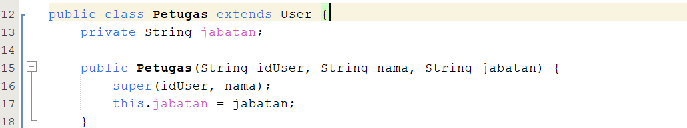

Dengan inheritance, bagian yang sama seperti `idUser` dan `nama` tidak perlu dibuat kembali pada setiap class turunan.

---

## Polymorphism

Polymorphism diterapkan melalui **overriding** dan **overloading**.

### Overriding

Method `tampilkanInfo()` didefinisikan pada class induk `User` sebagai abstract method. Method tersebut kemudian diimplementasikan kembali pada class `Warga` dan `Petugas`.

Pada `Warga`, method menampilkan informasi warga.

**[SCREENSHOT - OVERRIDING PADA WARGA]**

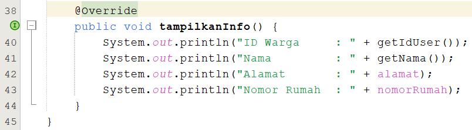

Pada `Petugas`, method yang sama digunakan untuk menampilkan informasi petugas.

**[SCREENSHOT - OVERRIDING PADA PETUGAS]**

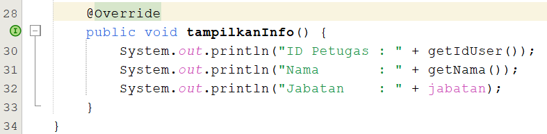

Nama method tetap sama, yaitu `tampilkanInfo()`, tetapi isi implementasinya berbeda sesuai dengan object yang digunakan.

### Overloading

Overloading diterapkan pada class `TagihanAir` melalui method `hitungTotal()`.

Terdapat method:

```text
hitungTotal()
hitungTotal(int pemakaian)
```

Keduanya memiliki nama yang sama, tetapi parameter berbeda.

**[SCREENSHOT - OVERLOADING]**

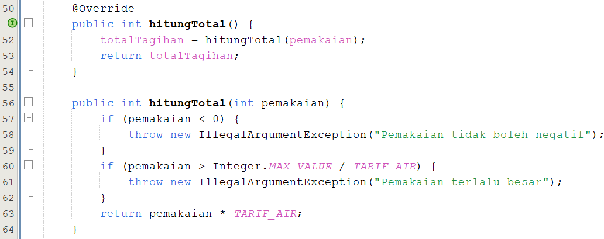

Method `hitungTotal()` digunakan untuk menghitung total tagihan berdasarkan data pemakaian yang tersimpan pada object, sedangkan `hitungTotal(int pemakaian)` dapat menerima nilai pemakaian sebagai parameter.

---

# Abstraction

Abstraction diterapkan menggunakan abstract class dan abstract method.

## Abstract Class

Class `User` dibuat sebagai abstract class.

**[SCREENSHOT - ABSTRACT CLASS]**

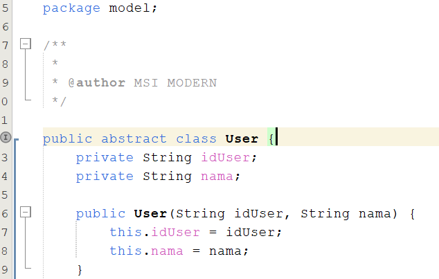

Class `User` menjadi dasar bagi class `Warga` dan `Petugas`. Karena merupakan abstract class, `User` digunakan sebagai konsep umum dan bukan sebagai object yang dibuat secara langsung.

## Abstract Method

Pada class `User` terdapat abstract method:

```text
public abstract void tampilkanInfo();
```

**[SCREENSHOT - ABSTRACT METHOD]**

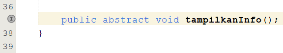

Method tersebut tidak memiliki isi pada class `User`. Implementasinya diberikan oleh class turunan `Warga` dan `Petugas`.

Penerapan ini sekaligus mendukung penggunaan overriding karena setiap class turunan memberikan bentuk implementasi `tampilkanInfo()` yang sesuai dengan jenis datanya.

---

# Interface

Program menggunakan interface `DapatDihitung`.

Interface berisi method:

```text
int hitungTotal();
```

**[SCREENSHOT - INTERFACE]**

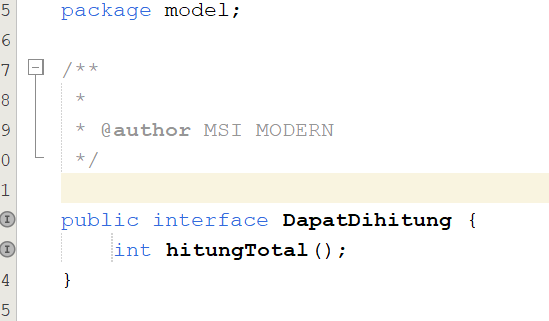

Interface tersebut kemudian diterapkan oleh class `TagihanAir`.

**[SCREENSHOT - IMPLEMENTASI INTERFACE]**

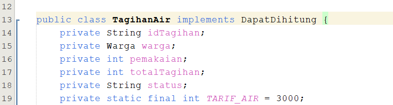

Dengan interface ini, proses perhitungan total tagihan memiliki aturan method yang harus diterapkan oleh class yang menggunakannya.

---

# Keyword final

Keyword `final` digunakan pada tarif air agar nilai tarif menjadi tetap dan tidak dapat diubah melalui pewarisan atau assignment ulang.

Contohnya:

```text
private static final int TARIF_AIR = 3000;
```

**[SCREENSHOT - KEYWORD FINAL]**

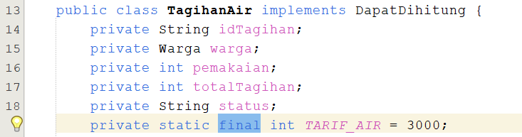

Nilai tersebut digunakan dalam proses perhitungan total tagihan.

---

# Fitur CRUD

## 1. Create

Program dapat menambahkan data warga dan tagihan.

### Tambah Data Warga

**[SCREENSHOT - TAMBAH DATA WARGA]**

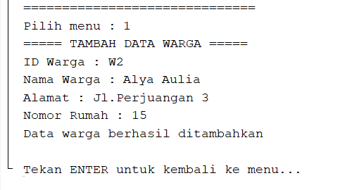

Data warga yang dimasukkan terdiri dari ID warga, nama, alamat, dan nomor rumah.

### Tambah Tagihan Air

**[SCREENSHOT - TAMBAH TAGIHAN AIR]**

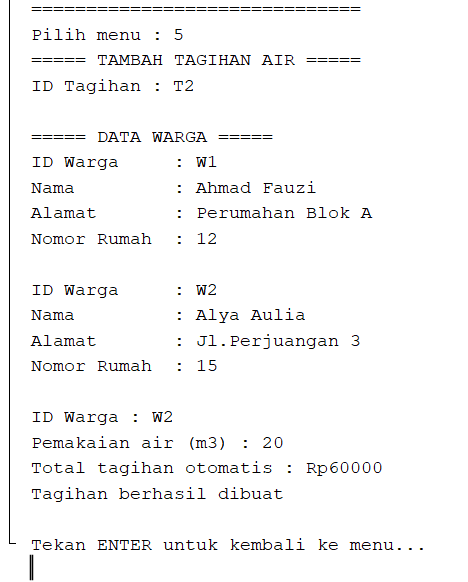

Pada contoh pengujian, warga `W2` memiliki pemakaian air sebesar `20 m3`.

Dengan tarif Rp3.000/m³, total tagihan dihitung:

```text
20 × Rp3.000 = Rp60.000
```

Program kemudian menampilkan bahwa tagihan berhasil dibuat.

---

## 2. Read

Data yang sudah tersimpan dapat ditampilkan melalui menu lihat data.

Fitur ini digunakan untuk melihat data warga, tagihan air, pembayaran, dan petugas.

> **TEMPAT SCREENSHOT - TAMPIL DATA**
>
> Tambahkan screenshot hasil menu `2`, `6`, `10`, dan/atau `11` di bagian ini jika screenshot tersebut sudah diambil.

---

## 3. Update

Data yang sudah tersimpan dapat diubah.

Pada pengujian, pemakaian tagihan `T2` diubah dari `20 m3` menjadi `30 m3`.

**[SCREENSHOT - UBAH TAGIHAN AIR]**

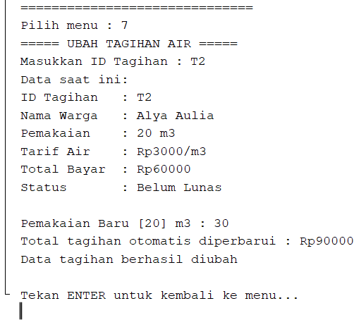

Total tagihan kemudian berubah dari:

```text
20 m3 × Rp3.000 = Rp60.000
```

menjadi:

```text
30 m3 × Rp3.000 = Rp90.000
```

Hal ini menunjukkan bahwa total tagihan dihitung kembali ketika pemakaian diubah.

> **TEMPAT SCREENSHOT - UBAH DATA WARGA**
>
> Tambahkan screenshot hasil menu `3` di bagian ini jika screenshot tersebut sudah diambil.

---

## 4. Delete

Program juga menyediakan menu untuk menghapus data warga dan tagihan.

> **TEMPAT SCREENSHOT - HAPUS DATA**
>
> Tambahkan screenshot hasil menu `4` dan menu `8` di bagian ini jika screenshot tersebut sudah diambil.

---

# Pembayaran

Pembayaran dilakukan dengan memilih ID tagihan terlebih dahulu. Program menampilkan data tagihan yang dipilih, kemudian meminta tanggal pembayaran dan jumlah pembayaran.

Pada pengujian:

- Tanggal `7-10-2026` ditolak karena tidak sesuai format.
- Setelah menggunakan format `07-10-2026`, tanggal diterima.
- Pembayaran Rp50.000 ditolak karena kurang dari total tagihan Rp90.000.
- Pembayaran Rp90.000 diterima.
- Status tagihan berubah menjadi `Lunas`.

**[SCREENSHOT - PEMBAYARAN DAN VALIDASI]**

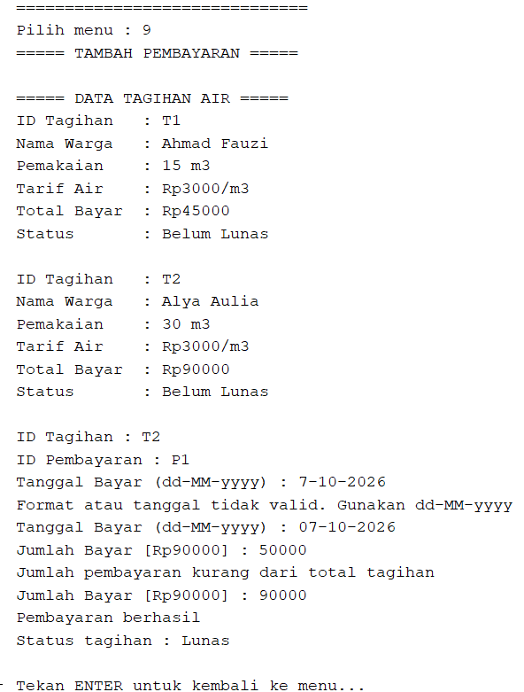

Alur pembayaran:

```text
Pilih tagihan
    ↓
Tampilkan data tagihan
    ↓
Input tanggal pembayaran
    ↓
Validasi tanggal
    ↓
Input jumlah pembayaran
    ↓
Bandingkan dengan total tagihan
    ↓
Pembayaran valid
    ↓
Status menjadi Lunas
```

---

# Validasi Input

Validasi ditambahkan sebagai perbaikan dari Mini Project 2. Tujuannya agar program tidak menerima input yang kosong, ID yang sudah digunakan, nilai pemakaian negatif, atau data pembayaran yang tidak sesuai.

## Input Tidak Boleh Kosong

Jika pengguna langsung menekan ENTER ketika diminta mengisi data, program menampilkan pesan bahwa input tidak boleh kosong.

**[SCREENSHOT - VALIDASI INPUT KOSONG]**

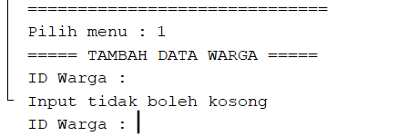

---

## ID Warga Tidak Boleh Sama

Program mengecek ID warga sebelum data ditambahkan.

Jika ID `W1` sudah digunakan dan dimasukkan kembali, program menolak data tersebut.

**[SCREENSHOT - VALIDASI ID WARGA]**

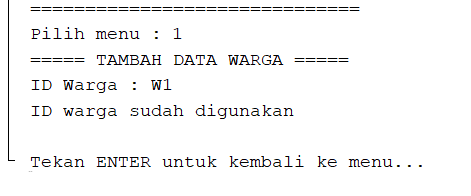

---

## ID Tagihan Tidak Boleh Sama

Program juga melakukan pengecekan terhadap ID tagihan.

Jika ID tagihan sudah digunakan, data tidak akan ditambahkan.

**[SCREENSHOT - VALIDASI ID TAGIHAN]**

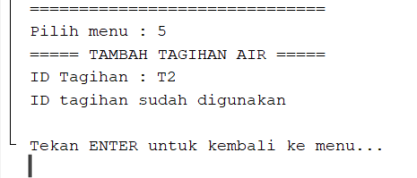

---

## Pemakaian Air Tidak Boleh Negatif

Nilai pemakaian air tidak boleh kurang dari nol.

Pada pengujian, input `-5` ditolak oleh program.

**[SCREENSHOT - VALIDASI PEMAKAIAN NEGATIF]**

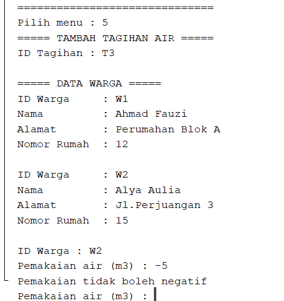

---

## Validasi Pembayaran

Jumlah pembayaran harus sesuai dengan total tagihan.

Pembayaran yang lebih kecil dari total tagihan ditolak. Pembayaran yang sesuai dengan total tagihan diterima dan status tagihan berubah menjadi `Lunas`.

Validasi tanggal juga diterapkan sehingga tanggal harus mengikuti format yang ditentukan program.

Dokumentasi pengujian pembayaran dan validasi tanggal dapat dilihat pada:

**[SCREENSHOT - PEMBAYARAN DAN VALIDASI]**

---

# Dokumentasi Pengujian

Pengujian dilakukan untuk memastikan fitur utama program berjalan sesuai dengan fungsi yang dibuat.

| Pengujian | Hasil |
|---|---|
| Menampilkan menu | Berhasil |
| Menambah warga | Berhasil |
| Menambah tagihan | Berhasil |
| Menghitung total tagihan | Berhasil |
| Mengubah tagihan | Berhasil |
| Validasi input kosong | Berhasil |
| Validasi ID warga | Berhasil |
| Validasi ID tagihan | Berhasil |
| Validasi pemakaian negatif | Berhasil |
| Validasi tanggal pembayaran | Berhasil |
| Validasi jumlah pembayaran | Berhasil |
| Mengubah status menjadi Lunas | Berhasil |

---

# Pengembangan dari Mini Project 2

Mini Project 3 dikembangkan dari program Mini Project 2 dengan menambahkan konsep PBO sesuai ketentuan tugas.

Perbaikan utama yang diterapkan:

1. Menambahkan **abstract class `User`**.
2. Menambahkan **abstract method `tampilkanInfo()`**.
3. Menerapkan **inheritance** pada `Warga` dan `Petugas`.
4. Menerapkan **overriding** pada `tampilkanInfo()`.
5. Menerapkan **overloading** pada `hitungTotal()`.
6. Menambahkan **interface `DapatDihitung`**.
7. Menggunakan **keyword `final`** pada tarif air.
8. Mempertahankan struktur **MVC**.
9. Menambahkan validasi input.
10. Menambahkan validasi ID agar tidak terjadi data duplikat.
11. Menambahkan validasi tanggal pembayaran.
12. Menambahkan validasi jumlah pembayaran terhadap total tagihan.

---

# Nilai Tambah

Nilai tambah yang diterapkan pada program adalah **struktur MVC dan polymorphism**.

Struktur MVC membuat program lebih terorganisir karena bagian model, tampilan, controller, dan pengelolaan data dipisahkan.

Polymorphism diterapkan melalui overriding dan overloading sehingga program tidak hanya memenuhi konsep dasar inheritance, tetapi juga menunjukkan penggunaan beberapa bentuk method dengan fungsi yang sesuai.

---

# Cara Menjalankan Program

1. Clone repository menggunakan Git.
2. Buka project menggunakan NetBeans.
3. Pastikan JDK sudah tersedia.
4. Jalankan file `Main.java`.
5. Program akan menampilkan menu utama.
6. Pilih menu sesuai kebutuhan.
7. Ikuti instruksi input yang ditampilkan.

---

# Repository

Repository Mini Project 3 dibuat terpisah dari repository Mini Project sebelumnya.

Format nama repository:

```text
Minpro-3-PBO-PengelolaanTagihanAir
```

Repository menggunakan Git untuk proses pengumpulan sesuai ketentuan tugas.

---

# Kesimpulan

Program Sistem Pengelolaan Tagihan Air Perumahan Warga berhasil dikembangkan sebagai Mini Project 3 dengan menerapkan konsep Pemrograman Berorientasi Objek yang dipersyaratkan.

Program telah menggunakan struktur MVC, encapsulation, inheritance, polymorphism melalui overriding dan overloading, abstraction melalui abstract class dan abstract method, serta interface. Selain itu, program dilengkapi validasi input untuk menjaga agar data yang dimasukkan sesuai dengan aturan sistem.

Pengembangan ini membuat program lebih terstruktur dibandingkan Mini Project sebelumnya dan menunjukkan penerapan konsep PBO pada program yang memiliki kebutuhan pengelolaan data warga, tagihan, dan pembayaran.
